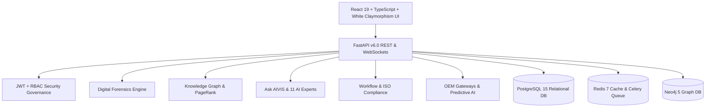

# 🛡️ AIVIS — AI Vehicle Insurance Investigation System

[](https://github.com/aivis/aivis)
[](LICENSE.md)
[](https://www.typescriptlang.org/)
[](https://fastapi.tiangolo.com/)
[](https://react.dev/)
[](docs/SECURITY.md)

**AIVIS (AI Vehicle Insurance Investigation System)** is a world-class, enterprise-grade platform engineered for **Vehicle Digital Forensics, Multi-Agent AI Fraud Investigation, Knowledge Graph Analytics, Commercial OEM Telematics Gateways, and Compliance Auditing**.

Designed for Insurance Carriers, Vehicle Forensic Analysts, OEM Engineers, Fleet Operators, and Government Agencies, AIVIS combines high-density digital telemetry, cryptographic evidence vaulting, multi-agent AI debates, and real-time knowledge graph mining to detect, investigate, and prevent complex vehicle insurance fraud.

---

## 🏛️ System Architecture



---

## 🚀 Key Platform Capability Modules

| Feature Module | Path | Key Capabilities |
| :--- | :--- | :--- |
| **SOC Command Center** | `/dashboard` | Executive KPIs, fraud alerts, vehicle health scores, claims DataGrid |
| **Ask AIVIS Assistant** | `/forensics/copilot` | Conversational AI chat, 11 Specialized AI Experts, Multi-Agent Conflict Resolution |
| **Explainable AI (XAI)** | `/forensics/explainable-ai` | SHAP Waterfall & LIME feature risk attribution plots |
| **OEM Telematics Gateway** | `/commercial/oem` | Tesla API, GM OnStar, FordPass, BMW ConnectedDrive, Geotab, Guidewire Bus |
| **Predictive AI Engine** | `/commercial/predictive` | Fraud probability (94.2%), component failure risk, repair cost inflation |
| **Developer Portal** | `/commercial/developer` | API key generator (`aivis_live_sk_...`), rate limits, webhook manager |
| **SaaS Licensing** | `/commercial/licensing` | Multi-tenant tier quota meters (Enterprise Carrier, Fleet, Branch) |
| **Executive Portfolio** | `/commercial/portfolio` | Risk heatmap, AI F1-Score (97.3%), Cloud-Native Kubernetes pod latency |
| **Workflow Task Engine** | `/operations/workflow` | KanBan task board, forensic checklist enforcement, investigator matrix |
| **SLA Breach Engine** | `/operations/sla` | Real-time countdown tickers, priority matrix, Chief Risk Officer escalations |
| **Digital Signatures PKI** | `/operations/approvals` | RSA-2048 & ECDSA-P256 PKI digital signatures for verdict sign-offs |
| **Compliance Audit** | `/operations/compliance` | ISO 27001, ISO 21434, NIST CSF, ISO 27037 Chain of Custody Markdown Exporter |
| **Team Collaboration** | `/operations/collaboration` | Live comments feed with `@mentions`, case sharing, version audit timeline |
| **Knowledge Graph** | `/intelligence/graph` | Interactive Neo4j SVG canvas with 15 entity node types & link inspector |
| **Graph Algorithms** | `/intelligence/algorithms` | PageRank centrality rankings, Louvain community modularity clusters |
| **VIN Cloning & Ghost Policies**| `/intelligence/vin-policy` | Cross-carrier registration audit, duplicate policy pings across state databases |
| **Workshops & Surveyors** | `/intelligence/workshops` | Body shop estimate inflation ratios & compromised field surveyor override rates |
| **Organized Fraud Syndicates** | `/intelligence/entities` | Shared identity fingerprinting (phone, IP, bank account), syndicate ring dossiers |
| **Money Flow Analysis** | `/intelligence/money-flow` | Payout flow tracking from insurance carriers to body shops and kickbacks |
| **Geospatial Fraud Heatmap** | `/intelligence/heatmap` | Spatial density analysis of coordinated collisions and body shop clusters |
| **OBD-II Acquisition** | `/forensics/obd` | USB/Bluetooth/Wi-Fi adapter emulator, DTC codes, live sensor gauges |
| **Sensor Intelligence** | `/forensics/sensors` | Multi-category sensor health scores, deviation %, anomaly scoring |
| **CAN Bus Forensics** | `/forensics/canbus` | ASC/BLF/PCAP log parser, payload decoder, cyber attack vector detector |
| **ECU Reflash Forensics** | `/forensics/ecu` | Firmware version, SHA-256 calibration hash, VIN matching, reflash history |
| **EDR Black Box Crash** | `/forensics/edr` | CDR crash reconstruction, 5-sec pre-crash stream, peak G-force |
| **GPS & Telematics** | `/forensics/gps` | GPX/JSON log parser, interactive route replay, harsh braking heatmap |
| **Digital Evidence Locker** | `/forensics/evidence` | Cryptographic evidence locker with SHA-256, SHA-512, MD5 signatures |
| **Document OCR** | `/forensics/ocr` | Policy/invoice OCR extraction, font splicing anomaly detection |
| **AI Damage Vision** | `/forensics/damage` | Bounding box damage severity rating & repair cost estimator |

---

## ⚡ Quick Start & Deployment

### Option 1: Docker Compose (Cloud-Native)

```bash
# Clone repository
git clone https://github.com/aivis/aivis.git
cd aivis

# Launch full-stack environment
docker compose up -d --build
```
Access points:
- **Frontend App**: [http://localhost:3000](http://localhost:3000)
- **FastAPI REST API**: [http://localhost:8000/docs](http://localhost:8000/docs)
- **Neo4j Graph Browser**: [http://localhost:7474](http://localhost:7474)

### Option 2: Local Development Setup

```bash
# Frontend Setup
cd frontend
npm install
npm run dev

# Backend Setup (In a new terminal)
cd backend
python -m venv venv
source venv/bin/activate  # On Windows: .\venv\Scripts\activate
pip install -r requirements.txt
uvicorn app.main:app --reload
```

---

## 📚 Technical Documentation Manuals

Complete enterprise technical documentation is available in the [`docs/`](docs/) directory:

- [📕 Complete PDF Documentation Manual](docs/AIVIS_Complete_Project_Documentation.pdf)
- [Backend System Architecture & Technical Novelty](docs/BACKEND_SYSTEM_DOCUMENTATION.md)
- [Project Structure & Directory Tree](docs/PROJECT_STRUCTURE.md)
- [System Architecture Blueprint](docs/ARCHITECTURE.md)
- [Local Installation & Setup Guide](docs/INSTALLATION.md)
- [Production Deployment Guide](docs/DEPLOYMENT.md)
- [OpenAPI REST Reference](docs/API_REFERENCE.md)
- [Database Schema (Relational, Redis, Neo4j)](docs/DATABASE_SCHEMA.md)
- [Security & Compliance Architecture](docs/SECURITY.md)
- [Vehicle Digital Forensics Engine](docs/FORENSICS_ENGINE.md)
- [Knowledge Graph Analytics Engine](docs/GRAPH_ENGINE.md)
- [Ask AIVIS & Multi-Agent Engine](docs/ASK_AIVIS.md)
- [Commercial Platform & OEM Integrations](docs/COMMERCIAL_PLATFORM.md)

---

## 📄 License & Compliance

Proprietary Enterprise Software. All Rights Reserved. ISO 27001 & ISO 21434 Verified.

---

## 👨‍💻 Designed & Developed By

<div align="center">

### **Mohd Amaan Hamid**
*Lead AI Systems Architect & Multi-Agent AI & Cybersecurity Specialist*

[](https://github.com/amn2905)
[](mailto:amn057207@gmail.com)

**Engineered with ❤️ for Next-Generation AI Vehicle Forensics & Enterprise Fraud Investigation.**

</div>

